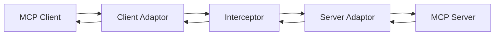

# MCP AMQP Transport

AMQP transport implementation for the Model Context Protocol (MCP), enabling MCP servers and clients to communicate over AMQP message brokers like RabbitMQ.

## Features

- **AMQP Transport Layer**: Full implementation of MCP transport over AMQP 0-9-1 protocol
- **Client & Server Support**: Both `ClientAMQPTransport` and `ServerAMQPTransport` classes
- **CLI Adaptors**: Command-line tools to bridge stdio-based MCP servers/clients with AMQP
- **Interceptor Framework**: Base class for building message interceptors
- **Flexible Configuration**: Support for environment variables and direct configuration
- **TLS Support**: Secure connections with AMQPS

## Installation

```bash
npm install -g @aws/mcp-amqp-transport
```

## Usage

### Using Transport Classes

You need to configure the following environment variables:
```
AMQP_HOSTNAME - AMQP broker hostname
AMQP_USERNAME - username for your broker
AMQP_PASSWORD - password for your broker
AMQP_PORT - AMQP broker port (default: 5672 for AMQP, 5671 for AMQPS) 
AMQP_USE_TLS - Use TLS connection (default: true)
```

Example:
```bash
export AMQP_HOSTNAME=localhost
export AMQP_PORT=5672
export AMQP_USERNAME=guest
export AMQP_PASSWORD=guest
export AMQP_USE_TLS=false
```

#### Server Transport

```typescript
import { Server } from '@modelcontextprotocol/sdk/server/index.js';
import { ServerAMQPTransport } from '@aws/mcp-amqp-transport';

const server = new Server(
  { name: 'my-server', version: '1.0.0' },
  { capabilities: {} }
);

// Configuration via environment variables
const transport = new ServerAMQPTransport({
  name: 'my-server',
  exchangeName: 'mcp-exchange'
  // hostname, port, username, password read from environment variables
});

await server.connect(transport);
```

#### Client Transport

```typescript
import { Client } from '@modelcontextprotocol/sdk/client/index.js';
import { ClientAMQPTransport } from '@aws/mcp-amqp-transport';

const client = new Client(
  { name: 'my-client', version: '1.0.0' },
  { capabilities: {} }
);

// Configuration via environment variables
const transport = new ClientAMQPTransport({
  serverName: 'my-server',
  exchangeName: 'mcp-exchange'
  // hostname, port, username, password read from environment variables
});

await client.connect(transport);
```

### Using CLI Adaptors

The package includes two CLI tools for bridging stdio-based MCP implementations with AMQP:

#### Server Adaptor

Wraps an existing stdio-based MCP server to communicate over AMQP:

```bash
# Set environment variables
export AMQP_HOSTNAME=localhost
export AMQP_PORT=5672
export AMQP_USERNAME=guest
export AMQP_PASSWORD=guest
export AMQP_USE_TLS=false

mcp-server-amqp-adaptor \
  --serverName my-server \
  --exchangeName mcp-exchange \
  --command "npx" \
  --args "-y" "@modelcontextprotocol/server-everything" \
  --additional-metadata "region=us-east-1,env=prod"
```

#### Client Adaptor

Provides a stdio interface for MCP clients to connect to AMQP-based servers:

```bash
# Set environment variables
export AMQP_HOSTNAME=localhost
export AMQP_PORT=5672
export AMQP_USERNAME=guest
export AMQP_PASSWORD=guest
export AMQP_USE_TLS=false

mcp-client-amqp-adaptor \
  --serverName my-server \
  --exchangeName mcp-exchange \
  --additional-metadata "clientType=web,version=1.0"
```

> **Note:** If you didn't install globally with `-g`, then you need to use `npx`.

### Building Interceptors
```bash
# Set environment variables
export AMQP_HOSTNAME=localhost
export AMQP_PORT=5672
export AMQP_USERNAME=guest
export AMQP_PASSWORD=guest
export AMQP_USE_TLS=false
```

Create custom message interceptors for monitoring, security, caching, or analytics:

```typescript
import { InterceptorBase, MessageProcessStatus } from '@aws/mcp-amqp-transport';

class MonitoringInterceptor extends InterceptorBase {
  async proccessClientToMCPMessage(message: any): Promise<MessageProcessStatus> {
    console.log('Client -> MCP:', message);
    // Add monitoring logic here
    return MessageProcessStatus.FORWARD;
  }

  async proccessMCPToClientMessage(message: any): Promise<MessageProcessStatus> {
    console.log('MCP -> Client:', message);
    // Add monitoring logic here
    return MessageProcessStatus.FORWARD;
  }
}

// Configuration via environment variables
const interceptor = new MonitoringInterceptor({
  inExchange: 'mcp-exchange-in',
  outExchange: 'mcp-exchange-out'
  // hostname, username, password read from environment variables
});

await interceptor.start();
```

## Configuration

The adaptors and SDK require an exchange to be specified on both the client and server. This is the key to decoupling mcp-client and mcp-server communication.

In `mcp-client-amqp-adaptor`, you specify the `serverName`, which is the MCP server you want to connect to, as well as the exchange to publish to and consume from.
In `mcp-server-amqp-adaptor`, you declare the `serverName` as an identifier for the client and also specify an exchange to publish to and consume from.

If you set the `exchangeName` to be the same in both adaptors, then messages will go directly from client to server. You can monitor and control the flow using the broker engine.

However, you can extend the architecture by adding your own interceptor to process these messages. You can have an application that sits in the middle:



The client adaptor binds to exchange-A, and the server adaptor binds to exchange-B. The interceptor (you can use the interceptor SDK) will process and route messages between exchange-A and exchange-B.


All transport classes and CLI tools support configuration via:

1. **Direct options** (highest priority)
2. **Environment variables** (fallback)

### Environment Variables

- `AMQP_HOSTNAME`: AMQP broker hostname
- `AMQP_USERNAME`: AMQP username
- `AMQP_PASSWORD`: AMQP password
- `AMQP_PORT`: AMQP broker port (default: 5672 for AMQP, 5671 for AMQPS)
- `AMQP_USE_TLS`: Use TLS connection (default: true)

### CLI Options

Both adaptors support the following additional options:

- `--additional-metadata`: Custom metadata as key=value pairs (comma-separated) to include in message headers

## Architecture

### Message Flow

```
Client -> [mcp.{serverName}.request] -> Server
Server -> [from-mcp.{serverName}.client-id.{clientId}] -> Client
```

### Routing Keys

- **Client to Server**: `mcp.{serverName}.request`
- **Server to Client**: `from-mcp.{serverName}.client-id.{clientId}`
- **Reply routing key**: Passed in message headers as `routingKeyToReply`

### Message ID Handling

The transport automatically augments message IDs with client identifiers to support multiple concurrent clients:

- Client sends message with `id: 1`
- Transport augments to `id: "client-uuid-1"`
- Server processes and responds with augmented ID
- Transport normalizes back to `id: 1` for client

## API Reference

### ServerAMQPTransport

```typescript
interface ServerAMQPTransportOptions {
  name: string;              // Server name
  exchangeName: string;      // AMQP exchange name
  hostname?: string;         // Broker hostname
  port?: number;            // Broker port
  username?: string;        // AMQP username
  password?: string;        // AMQP password
  useTLS?: boolean;         // Use TLS connection
}
```

### ClientAMQPTransport

```typescript
interface ClientAMQPTransportOptions {
  serverName: string;       // Target server name
  exchangeName: string;     // AMQP exchange name
  hostname?: string;        // Broker hostname
  port?: number;           // Broker port
  username?: string;       // AMQP username
  password?: string;       // AMQP password
  useTLS?: boolean;        // Use TLS connection
}
```

### InterceptorBase

```typescript
interface InterceptorOptions {
  inExchange: string;       // Input exchange
  outExchange: string;      // Output exchange
  hostname?: string;        // Broker hostname
  port?: number;           // Broker port
  username?: string;       // AMQP username
  password?: string;       // AMQP password
  useTLS?: boolean;        // Use TLS connection
}

enum MessageProcessStatus {
  FORWARD = 'forward',      // Forward message unchanged
  REJECT = 'reject',        // Reject message and send it back to the previous exchange
  ERROR = 'error',          // Error occurred
  DROP = 'drop',            // Drop message
  TRANSFORM = 'transform'   // Transform message and forward that instead
}
```

## Development

### Code Quality Tools

This project uses ESLint, Prettier, and TypeScript for code quality and consistency.

#### Available Scripts

```bash
# Run linter
npm run lint

# Auto-fix linting issues
npm run lint:fix

# Check code formatting
npm run format:check

# Format code
npm run format

# Type checking
npm run type-check

# Run tests
npm test

# Build the project
npm run build
```

#### Pre-commit Hooks

The project uses Husky and lint-staged to automatically lint and format code before commits. This ensures all committed code meets quality standards.

## Security

See [CONTRIBUTING](CONTRIBUTING.md#security-issue-notifications) for more information.

## License

This project is licensed under the Apache-2.0 License.